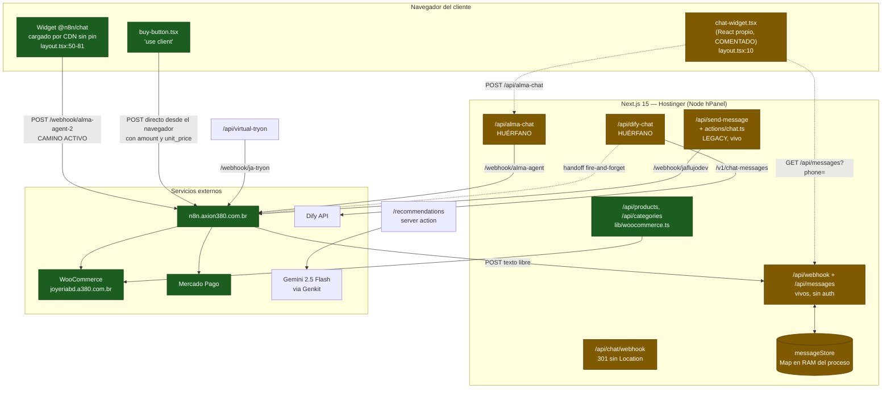
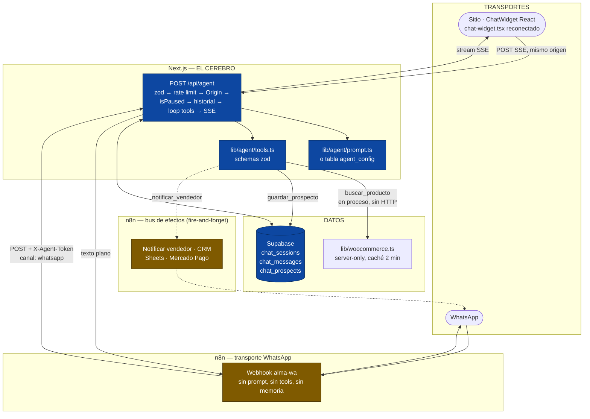

# Arquitectura — Joyería Alianza

> **Nota de trazabilidad.** Toda afirmación sobre el código cita `archivo:línea` relativo a la raíz del repo (`~/ja`). Las afirmaciones sobre el workflow de n8n provienen de `ref/ALMA_N8N_A_NATIVO.md`, que es la fuente de verdad designada para esas conclusiones.
>
> **Fuente faltante.** El archivo `ref/workflow-n8n-alma.json` **no existe** en el repo al momento de escribir esto (`ref/` contiene únicamente `AGENTE_ALMA_V2.md` y `ALMA_N8N_A_NATIVO.md`). Todo lo que se afirma acá sobre nodos, tools y prompt del workflow n8n está tomado de las citas literales incluidas en `ref/ALMA_N8N_A_NATIVO.md` — **no fue verificado contra el JSON original**. Los puntos marcados con ⚠️ requieren verificación contra el workflow real antes de tomarlos como definitivos.

---

## 1. Estado actual (AS-IS)

### 1.1 Stack y versiones reales

Versiones exactas de `package.json`. No son rangos aspiracionales: es lo que está declarado.

| Capa | Paquete | Versión declarada |
|---|---|---|
| Framework | `next` | `15.5.9` (pin exacto, sin `^`) |
| Runtime UI | `react` / `react-dom` | `^19.2.1` |
| Lenguaje | `typescript` | `5.9.3` (pin exacto) |
| Node | `engines.node` | `>=20.x` (`package.json:5-7`) |
| Estilos | `tailwindcss` | `^3.4.17` (dev) + `tailwindcss-animate` `^1.0.7` |
| Design system | `@radix-ui/*` (22 paquetes) | ver `package.json:19-42` |
| Datos | `@supabase/supabase-js` | `^2.97.0` |
| IA | `genkit` + `@genkit-ai/google-genai` + `@genkit-ai/next` | `^1.2.0` |
| Validación | `zod` | `^3.24.2` — **cero imports en todo `src/`** |
| Backend as a service | `firebase` | `^11.9.1` — **cero imports en todo `src/`** |
| 3D / visión | `three` `^0.173.0`, `@mediapipe/*` (3 paquetes) | **cero imports en `src/`** |
| Drag & drop | `@dnd-kit/*` (3 paquetes) | **cero imports en `src/`** |
| Otros sin uso | `wav` `^1.0.2`, `date-fns` `^3.6.0`, `recharts` `^2.15.1` | instalados, sin consumidor verificado |

Notas de configuración que condicionan todo lo demás:

- `next.config.ts:7-14` — `typescript.ignoreBuildErrors: true` y `eslint.ignoreDuringBuilds: true`. Además `eslint` **no está en `devDependencies`**, con lo cual el script `lint` de `package.json:12` no puede ejecutarse. No hay tests en el repo. Resultado: entre un commit y producción no hay ninguna verificación automática.
- `next.config.ts:17` — `images.unoptimized: true`, justificado en el comentario como necesidad del hosting compartido.
- `next.config.ts:18-38` — solo tres hosts remotos permitidos: `joyeriabd.a380.com.br` (el WordPress), `images.unsplash.com`, `picsum.photos`.
- `src/middleware.ts:4-38` — el único middleware existente es el modo mantenimiento (`MAINTENANCE_MODE`). No hay CSP, HSTS, rate limit ni verificación de `Origin`.

### 1.2 El flujo de chat real (no el documentado)

`README.md:48-56` y `RUNBOOK.md:8-16` afirman que el chat web habla directo con Dify vía `/api/dify-chat`. **Eso es falso en el código desplegado.** El camino vivo es un widget de terceros cargado por CDN que habla directo con n8n desde el navegador, sin pasar por Next.js.

Evidencia:

- `src/app/layout.tsx:10` — `// import { ChatWidget } from '@/components/chat-widget';` — el widget React propio está **comentado**, con el comentario "Reemplazado por Evolution Widget".
- `src/app/layout.tsx:50-53` — `<link>` a `https://cdn.jsdelivr.net/npm/@n8n/chat/dist/style.css`, **sin versión fijada**.
- `src/app/layout.tsx:54-81` — `<Script id="n8n-chat-widget" type="module">` que hace `import { createChat } from 'https://cdn.jsdelivr.net/npm/@n8n/chat/dist/chat.bundle.es.js'`, también **sin versión fijada**.
- `src/app/layout.tsx:62` — `webhookUrl: 'https://n8n.axion380.com.br/webhook/alma-agent-2'`. El navegador postea ahí directamente.

Consecuencias directas de ese diseño, sin interpretación:

1. La URL del webhook de n8n queda en el HTML servido a todo visitante.
2. No hay rate limit, verificación de `Origin` ni tope de coste posible: la request no atraviesa el servidor Next.js.
3. `chat.bundle.es.js` sin pin de versión se ejecuta en **todas** las páginas, incluida la de producto donde vive el botón de compra (`src/components/buy-button.tsx`). Una versión comprometida del paquete ejecuta código arbitrario en el flujo de pago.

#### Diagrama del estado real



#### Los 4 caminos de chat huérfanos

Además del camino activo (widget `@n8n/chat` → `alma-agent-2`), hay cuatro implementaciones de chat desplegadas en producción que ningún componente monta hoy — pero cuyos endpoints siguen accesibles desde internet.

| # | Camino | Archivos | Destino | Estado real | Riesgo concreto |
|---|---|---|---|---|---|
| 1 | `/api/alma-chat` → n8n `alma-agent` | `src/app/api/alma-chat/route.ts:16-18` | webhook **`alma-agent`** (distinto del activo, que es `alma-agent-2`) | Desplegado. Solo lo llamaba `chat-widget.tsx:241`, que está comentado en el layout | Endpoint de IA abierto, sin auth ni rate limit. Devuelve campo `debug` con status y duración (`:62`, `:75-78`) |
| 2 | `/api/dify-chat` → Dify | `src/app/api/dify-chat/route.ts:106-117` | `serverSettings.difyBaseUrl` + `/chat-messages` | Desplegado, sin consumidor en `src/` | Devuelve `debug.raw` con el **error crudo de Dify** al navegador (`:127`). Detección de handoff por *string matching* de 12 frases (`:16-38`) |
| 3 | `/api/send-message` + `actions/chat.ts` → n8n `jaflujodev` | `src/app/api/send-message/route.ts:13`, `src/app/actions/chat.ts:16` | `appSettings.n8nWebhookUrl` (`src/lib/settings.ts:15`) | Ambos se auto-marcan `[LEGACY]` por `console.warn` en la primera línea del handler | `actions/chat.ts:62-68` devuelve al navegador `debug.url` (la URL del webhook n8n) **más el payload completo con teléfono y nombre del cliente** |
| 4 | `/api/webhook` + `/api/messages` → handoff humano | `src/app/api/webhook/route.ts`, `src/app/api/messages/route.ts` | `src/lib/messageStore.ts` (Map en RAM) | Vivos. n8n postea a `/api/webhook` según `RUNBOOK.md:46-56` | `/api/webhook` acepta `{text, senderName, phoneNumber}` **sin firma** (`:11-32`): cualquiera inyecta mensajes atribuidos a "Alma". `/api/messages?phone=...` (`:13`) es un **IDOR**: devuelve la bandeja de cualquier teléfono y `consume()` la **borra** (`messageStore.ts:47-52`), con lo cual el cliente legítimo nunca la recibe |

Un quinto artefacto muerto: `src/app/api/chat/webhook/route.ts:8` devuelve `301` **sin header `Location`**. Un 301 sin `Location` no redirige nada; es un stub que no cumple su propósito declarado.

#### Problemas del camino activo, aparte de los ya listados

Según `ref/ALMA_N8N_A_NATIVO.md` (⚠️ no verificable contra el JSON, que falta):

- **La tool `buscar_producto` nunca funcionó.** El nodo apunta a `https://TU-WORDPRESS.com/wp-json/wc/v3/products`, el placeholder del template sin reemplazar (`ALMA_N8N_A_NATIVO.md:10-14`). Consecuencia: **todo precio, material, SKU o stock que Alma mencionó, lo inventó**. La regla del prompt "nunca inventes datos" es inaplicable porque el modelo nunca tuvo datos.
- Además, en el mismo nodo, ningún parámetro de query tiene `value`, lo que en `toolHttpRequest` significa que **los rellena el modelo** — incluidos `consumer_key` y `consumer_secret` (`ALMA_N8N_A_NATIVO.md:20-29`).
- **La pausa (handoff humano) no funciona en canal web.** El nodo compara `chat_handoff.client_phone` contra `$json.sessionId`. En WhatsApp el `sessionId` es el teléfono y matchea; en web es `web_1730000000000` y **nunca matchea** (`ALMA_N8N_A_NATIVO.md:33-44`). Esto se corresponde con el código: `src/components/chat-widget.tsx:66` construye `web_${parsedUser.phone}` y `:73` construye `web_anon_${Date.now()}`.
- **Memoria en RAM de n8n** (`memoryBufferWindow`, 20 interacciones): redeploy, OOM o restart borra todas las conversaciones activas (`ALMA_N8N_A_NATIVO.md:66-70`).
- **Sin streaming**: `responseMode: responseNode` obliga al navegador a esperar todo el loop de tool calling, 10-20 s (`ALMA_N8N_A_NATIVO.md:85-87`).
- **El system prompt está literalmente a medias**: contiene `[PROMPT DETALLADO SE CONFIGURA EN FASE 2]` (`ALMA_N8N_A_NATIVO.md:91-97`).

### 1.3 Tabla de integraciones

Estado según los criterios: **ACTIVA** = hay un camino de ejecución real desde el sitio en producción. **HUÉRFANA** = el código está desplegado y el endpoint responde, pero ningún componente montado lo invoca. **INACTIVA** = el código existe pero no hace nada, o no está conectado a nada.

| Integración | Estado | Archivo que lo prueba | Detalle |
|---|---|---|---|
| **WooCommerce (catálogo)** | **ACTIVA** | `src/lib/woocommerce.ts:59-141`, consumida por `src/app/api/products/route.ts:3` y `src/app/api/categories/route.ts:2` | Auth `Basic` en header, correcto (`woocommerce.ts:94`). Caché en memoria 2 min (`:7`, `:85-87`) + deduplicación de requests concurrentes (`:89-91`). **Las env vars que lee son `WOO_BASE_URL` / `WOO_CONSUMER_KEY` / `WOO_CONSUMER_SECRET` (`:11-13`), pero `README.md:24-26` y `RUNBOOK.md:67-69` documentan `WC_API_URL` / `WC_CONSUMER_KEY` / `WC_CONSUMER_SECRET`.** Quien siga la documentación obtiene catálogo vacío. Además, el fallback a caché expirada en `:125-128` sirve datos viejos **indefinidamente** tras un fallo de red — puede mostrar precios desactualizados sin límite temporal |
| **n8n — chat web** | **ACTIVA** | `src/app/layout.tsx:62` | Webhook `alma-agent-2`, invocado por el navegador directamente. Es el único camino de chat vivo |
| **n8n — checkout Mercado Pago** | **ACTIVA** | `src/lib/checkout.ts:64` → `appSettings.checkoutWebhookUrl` (`src/lib/settings.ts:21`, hardcodeada sin env var) | Ver §1.4 |
| **n8n — virtual try-on** | **ACTIVA** | `src/app/api/virtual-tryon/route.ts:3` → `/webhook/ja-tryon`, consumido por `src/components/virtual-try-on.tsx:55` | Timeout de **90 s** por request y acepta `photoDataUri` sin tope de tamaño. Sin rate limit |
| **n8n — `alma-agent` (flujo 1)** | **HUÉRFANA** | `src/app/api/alma-chat/route.ts:16-18` | Endpoint desplegado, sin consumidor montado |
| **n8n — `jaflujodev` (legacy WhatsApp)** | **HUÉRFANA** | `src/lib/settings.ts:15`, usada en `src/app/api/send-message/route.ts:40` y `src/app/actions/chat.ts:38` | Ambos consumidores se auto-marcan `[LEGACY]` |
| **n8n — retorno de mensajes a la web** | **HUÉRFANA** | `src/app/api/webhook/route.ts:27` → `messageStore.add()` | El único lector es el polling de `src/components/chat-widget.tsx:143-166`, componente comentado en el layout. Los mensajes que n8n postea hoy se acumulan en RAM y nadie los consume |
| **Dify** | **HUÉRFANA** | `src/app/api/dify-chat/route.ts:106-117`, credenciales en `src/lib/settings.ts:25-28` | Sin consumidor en `src/`. `README.md:61` documenta que la API key **estuvo hardcodeada en Base64 en `settings.ts`**; si ese commit está en el historial de Git, la key es recuperable y debe asumirse comprometida. Hoy `settings.ts:25-26` ya lee de `process.env` con fallback a string vacío |
| **Supabase** | **INACTIVA en el sitio** | `src/lib/supabase.ts:10` exporta el cliente; **`grep -r "lib/supabase" src/` no devuelve ningún import** | El cliente se crea con la **anon key** y la URL del proyecto está **hardcodeada** como fallback (`supabase.ts:3`: `https://lgdhnkfxberjzctgywiz.supabase.co`). El módulo define tipos `Order` / `OrderItem` y constantes de Kanban (`:13-62`) para el dashboard que `README.md:35-46` describe en `/admin/orders` — **ese directorio no existe en `src/app/`**. Es decir: el dashboard documentado no está en este repo. Supabase sí aparece usado desde n8n según `README.md:79-80` |
| **Genkit / Gemini 2.5 Flash** | **ACTIVA (parcial)** | `src/ai/genkit.ts:4-7` (`googleai/gemini-2.5-flash`) | El flow `personalized-recommendations.ts` **sí se usa**: `src/app/recommendations/page.tsx:4` lo importa. El flow `virtual-try-on.ts` está **HUÉRFANO**: solo lo referencia `src/ai/dev.ts:4`; el componente real (`virtual-try-on.tsx:55`) llama a `/api/virtual-tryon`, que va a n8n. O sea: hay un proveedor de IA ya pago y configurado, usado para una sola pantalla |
| **Firebase** | **INACTIVA** | `src/lib/firebase.ts:5-8` | `isConfigValid = false`, `db = null`, `storage = null`. Es un stub inerte, y además ningún archivo de `src/` lo importa. El paquete `firebase@^11.9.1` pesa en el bundle sin razón |
| **Mercado Pago** | **ACTIVA, vía n8n** | `src/lib/checkout.ts:35-96` | Nunca se habla con la API de MP desde el sitio; n8n crea la preferencia y devuelve `redirect_url` (`:84-95`) |

### 1.4 El defecto de arquitectura más caro: el precio lo controla el navegador

Cadena verificable:

1. `src/lib/checkout.ts` **no tiene la directiva `'use server'`** — el archivo abre con un `@fileOverview` en la línea 1 y su primer import está en la línea 7.
2. `src/components/buy-button.tsx:1` declara `'use client'` y `:5` importa `createCheckoutPreference` de ese archivo.
3. Por lo tanto `checkout.ts:64` (`fetch(appSettings.checkoutWebhookUrl, ...)`) **se ejecuta en el navegador**.
4. El payload que viaja incluye `amount: product.price.usd` (`checkout.ts:46`) y `unit_price: product.price.usd` (`:53`).
5. La URL de destino está hardcodeada en `src/lib/settings.ts:21` y, al importarse `appSettings` desde un componente cliente, **viaja en el bundle JS público**.

Es decir: el importe de la preferencia de Mercado Pago lo envía el cliente, a un webhook sin autenticación cuya URL es pública. El mismo problema alcanza a `almaWebhookUrl` (`settings.ts:12`) y `n8nWebhookUrl` (`settings.ts:15`), que también quedan expuestos por el mismo mecanismo.

Esto no es parte de la migración del agente, pero es el ítem que debería ejecutarse primero porque es dinero real (coincide con la recomendación de `ref/AGENTE_ALMA_V2.md:294`).

---

## 2. Arquitectura objetivo (TO-BE)

### 2.1 El principio: UN CEREBRO, DOS TRANSPORTES

La tentación obvia es replicar el workflow adentro del sitio y apagar n8n. Es un error: se perdería el canal de WhatsApp, que probablemente vende más que la web (`ref/ALMA_N8N_A_NATIVO.md:139-141`).

La decisión correcta no es *elegir* entre n8n y el app web, sino **partir por responsabilidad**:

> **El cerebro** — system prompt, definición de tools, loop de tool calling y memoria conversacional — vive en **un solo lugar**: `/api/agent` en Next.js, versionado en Git.
>
> **Los transportes** — el widget web y WhatsApp — son intercambiables y tontos. n8n queda como transporte de WhatsApp y como **bus de efectos asíncronos** (notificar al vendedor, escribir en el CRM), fuera del camino crítico de la request.

Criterio de aceptación de esta arquitectura, en una línea: **si n8n se cae, la web tiene que seguir vendiendo.** Hoy no.

### 2.2 Diagrama TO-BE



Las flechas punteadas son fire-and-forget: si fallan, la conversación continúa.

### 2.3 Tabla de responsabilidades

| Componente | Dónde va | Por qué ahí |
|---|---|---|
| **System prompt de Alma** | Next.js (`src/lib/agent/prompt.ts`) o tabla `agent_config` en Supabase | Hoy vive en un JSON que se edita a mano en una UI y no tiene historial ni diff. En Git se revisa, se revierte y se sabe qué versión estaba activa cuando un cliente se quejó. La alternativa `agent_config` se discute en el ADR-001 |
| **Definición de tools + schemas** | Next.js (`src/lib/agent/tools.ts`, con `zod`) | El SDK serializa el JSON. Esto elimina **por construcción** el bug de JSON injection del workflow: hoy `{resumen}` y `{notas}` se interpolan como texto en un template de string, y basta que el modelo escriba una comilla doble o un salto de línea para invalidar el JSON y **perder el lead en silencio** (`ALMA_N8N_A_NATIVO.md:50-62`). `zod` ya está instalado (`package.json`) y sin usar |
| **`buscar_producto`** | Next.js, llamando `fetchWooCommerce()` **en proceso** | Es el argumento más fuerte de todos: la tool queda **donde ya viven las credenciales y el cliente HTTP probado**. Sin salto HTTP, sin credenciales en query string, y hereda la caché de 2 min y la deduplicación que ya existen (`src/lib/woocommerce.ts:85-91`). El bug del placeholder `TU-WORDPRESS.com` es consecuencia directa de haber duplicado esta integración en n8n |
| **`guardar_prospecto`** | Next.js → INSERT/UPSERT en `chat_prospects` | Escritura transaccional en la base propia. Mantener **exactamente** los mismos nombres de campo que ya usa el workflow (`nombre`, `producto`, `para_quien`, `ocasion`, `urgencia`, `canal`, `notas`, `resumen`) porque el prompt ya está afinado para ese vocabulario (`ALMA_N8N_A_NATIVO.md:235`) |
| **`notificar_vendedor`** | Next.js escribe en Supabase + POST fire-and-forget a n8n **con token** | El registro del lead es la parte que no puede perderse: va a la base primero. El envío del WhatsApp al vendedor es un efecto, y los efectos son exactamente lo que n8n hace bien |
| **Memoria conversacional** | Supabase (`chat_messages`), últimos ~20 turnos | Hoy es un buffer en RAM de n8n: un restart borra todas las conversaciones activas, y con dos instancias cada una tiene su mitad del historial (`ALMA_N8N_A_NATIVO.md:66-70`). Y **nunca** se lee del payload del cliente: eso permitiría reescribir el historial y hacer prompt injection trivial |
| **Estado de pausa / handoff** | Supabase (`chat_sessions.is_paused`) — una query por `session_key` **y** por `telefono` | Ver §3.3. Es el fix del bug comercialmente más caro |
| **Streaming al cliente** | Next.js, SSE | n8n con `responseMode: responseNode` no puede emitirlo. Es lo único de toda esta lista que el cliente **siente** |
| **Rate limit, validación, verificación de `Origin`** | Next.js — `middleware.ts` es el lugar natural, ya existe | Hoy la request de chat ni siquiera pasa por el servidor propio (`layout.tsx:62`), con lo cual no hay dónde poner un tope de coste |
| **Transporte de WhatsApp** | **n8n** (webhook `alma-wa` → `POST /api/agent`) | Reimplementar el canal WhatsApp en Next.js es mucho trabajo por cero valor. n8n ya lo tiene resuelto |
| **CRM / Google Sheets / notificación al vendedor** | **n8n** | Integraciones de terceros, asíncronas, tolerantes a fallo, que cambian seguido y no requieren deploy. Es literalmente el caso de uso de n8n |
| **Creación de preferencia de Mercado Pago** | **n8n**, pero invocada desde una route server-only de Next.js | El orquestador puede quedarse en n8n; lo que no puede seguir es que el **importe** lo mande el navegador (§1.4). Next.js resuelve el precio contra WooCommerce y firma la llamada |
| **Virtual try-on** | Decisión pendiente | Hoy hay dos implementaciones paralelas: `/api/virtual-tryon` → n8n (la que usa el componente) y `src/ai/flows/virtual-try-on.ts` → Genkit/Gemini (huérfana). Hay que elegir una y borrar la otra. **No verificado**: cuál de las dos da mejor resultado visual |

### 2.4 Lo que hay que conservar del workflow actual

La arquitectura de n8n está bien pensada; lo que está mal es la implementación. Esto **no** se tira (`ref/ALMA_N8N_A_NATIVO.md:120-134`):

- **Reglas de formato**: máximo 4 líneas, 1 pregunta, 1 emoji, sin tablas ni bullets. Es lo que hace que Alma no suene a ChatGPT — vale más que el modelo que se elija.
- **Embudo de 6 pasos**: producto → para quién → ocasión → nombre → descripción emocional → notificar. Es un guion de venta real.
- **"Después de notificar, seguí conversando"**: la mayoría de las implementaciones abandonan al cliente en ese punto.
- **El mecanismo de pausa** (`is_paused` + `resume_at`): el diseño es correcto, solo está roto el matching.
- **Fallback de precio** ("varía según el peso del metal del día"): honesto y comercialmente útil.
- **Un agente, dos canales**: correcto, y es exactamente la razón por la que n8n no se borra.

Un punto del prompt actual sí hay que reformular: la instrucción *"Nunca admitas ser IA, bot o asistente"* (`ALMA_N8N_A_NATIVO.md:101-116`). No funciona — un cliente que insiste dos o tres veces la rompe, y ahí el daño de marca es peor que si hubiera sido clara. Y para una boutique que vende confianza y certificación, negar activamente es un riesgo desproporcionado. Reformulación propuesta que conserva la intención: no presentarse como IA ni mencionarlo espontáneamente, pero si preguntan directamente, responder con naturalidad que es la asistente virtual de la boutique y ofrecer pasar con una asesora al instante.

---

## 3. Modelo de datos objetivo en Supabase

Tres tablas. El diseño se apoya en el que ya existe en el workflow (`chat_handoff` con `is_paused` y `resume_at`), corrigiendo la clave de matching.

### 3.1 SQL

```sql
-- =====================================================================
-- Joyería Alianza — Esquema del agente Alma
-- Todas las tablas se acceden EXCLUSIVAMENTE con service_role desde
-- los route handlers de Next.js. Nunca desde el navegador.
-- =====================================================================

-- ---------------------------------------------------------------------
-- chat_sessions — una fila por conversación, sea cual sea el canal.
-- Esta es la tabla que arregla el bug de la pausa en web.
-- ---------------------------------------------------------------------
create table chat_sessions (
  id            uuid primary key default gen_random_uuid(),

  -- Clave unificada de sesión. DOS formatos, un solo espacio de nombres:
  --   'web:<token_opaco>'  → token generado en el SERVIDOR, nunca el teléfono
  --   'wa:<telefono>'      → teléfono en dígitos, sin '+' ni espacios
  -- El prefijo hace imposible una colisión entre canales y hace que la
  -- consulta de pausa sea idéntica para los dos transportes.
  session_key   text unique not null,

  canal         text not null check (canal in ('web','whatsapp')),

  -- Se llena cuando Alma consigue el dato durante el embudo.
  -- En canal 'whatsapp' viene poblado desde el primer mensaje.
  -- En canal 'web' arranca NULL: es lo que permite unificar los dos
  -- hilos cuando el cliente que empezó en la web deja su WhatsApp.
  telefono      text,
  nombre        text,

  -- La asesora humana tomó el control: Alma se calla.
  is_paused     boolean not null default false,

  -- Reanudación automática. NULL = pausa indefinida hasta despausar a mano.
  -- La sesión está efectivamente pausada si:
  --   is_paused AND (resume_at IS NULL OR resume_at > now())
  resume_at     timestamptz,

  created_at    timestamptz not null default now(),
  last_seen_at  timestamptz not null default now()
);

-- Lookup principal: por session_key. Ya cubierto por el UNIQUE de arriba.

-- Lookup secundario: por teléfono. Es el que permite que una pausa
-- puesta desde WhatsApp también silencie el hilo web del mismo cliente.
-- Parcial porque la mayoría de las sesiones web nunca tienen teléfono.
create index chat_sessions_telefono_idx
  on chat_sessions (telefono)
  where telefono is not null;

-- Barrido de sesiones pausadas cuyo resume_at ya venció.
create index chat_sessions_resume_idx
  on chat_sessions (resume_at)
  where is_paused = true;

-- Housekeeping: purgar sesiones web anónimas viejas.
create index chat_sessions_last_seen_idx on chat_sessions (last_seen_at);


-- ---------------------------------------------------------------------
-- chat_messages — historial. Reemplaza a la vez el memoryBufferWindow
-- de n8n (RAM, se pierde en cada restart) y a src/lib/messageStore.ts
-- (Map en RAM del proceso Node, se pierde igual y se rompe con más de
-- una instancia).
-- ---------------------------------------------------------------------
create table chat_messages (
  id          bigserial primary key,
  session_id  uuid not null references chat_sessions(id) on delete cascade,

  -- 'user' | 'assistant' | 'tool' | 'system'
  -- 'tool' guarda el resultado devuelto por una tool: es lo que permite
  -- auditar DE DÓNDE salió un precio que Alma le dijo a un cliente.
  rol         text not null check (rol in ('user','assistant','tool','system')),

  contenido   text not null,

  -- Solo para rol = 'tool': qué tool y con qué argumentos.
  tool_name   text,
  tool_args   jsonb,

  -- Control de coste por conversación.
  tokens_in   int,
  tokens_out  int,

  created_at  timestamptz not null default now()
);

-- La consulta caliente: últimos N mensajes de una sesión, en orden.
-- DESC porque se leen los últimos ~20 y se invierten en memoria.
create index chat_messages_session_idx
  on chat_messages (session_id, created_at desc);


-- ---------------------------------------------------------------------
-- chat_prospects — el lead calificado. Es el output comercial del embudo.
-- Los nombres de campo son DELIBERADAMENTE los mismos que ya usan las
-- tools del workflow n8n: el system prompt está afinado para ese
-- vocabulario y cambiarlo obliga a reescribir el prompt.
-- ---------------------------------------------------------------------
create table chat_prospects (
  id           uuid primary key default gen_random_uuid(),
  session_id   uuid references chat_sessions(id) on delete set null,

  nombre       text,
  telefono     text,
  producto     text,        -- pieza de interés, texto libre del embudo
  producto_id  bigint,      -- id de WooCommerce si la tool lo resolvió
  para_quien   text,
  ocasion      text,
  urgencia     text,
  canal        text not null check (canal in ('web','whatsapp')),
  notas        text,
  resumen      text,        -- resumen generado por el modelo

  -- Ciclo de vida del lead. No es el estado del pedido: eso vive
  -- en las tablas del dashboard (orders), fuera de este esquema.
  estado       text not null default 'nuevo'
               check (estado in ('nuevo','notificado','contactado','cerrado','descartado')),

  -- Marca de que el POST fire-and-forget a n8n salió OK.
  -- Si queda NULL, hay un lead guardado que el vendedor nunca vio:
  -- eso se monitorea. Antes esos leads se perdían en SILENCIO.
  notificado_at timestamptz,

  created_at   timestamptz not null default now()
);

create index chat_prospects_estado_idx  on chat_prospects (estado, created_at desc);
create index chat_prospects_telefono_idx on chat_prospects (telefono);

-- Leads guardados que nunca se notificaron: la query de la alerta.
create index chat_prospects_sin_notificar_idx
  on chat_prospects (created_at)
  where notificado_at is null;
```

### 3.2 RLS

```sql
alter table chat_sessions  enable row level security;
alter table chat_messages  enable row level security;
alter table chat_prospects enable row level security;
```

Sin políticas declaradas, RLS con `enable` bloquea todo acceso vía `anon` y `authenticated`. `service_role` bypassea RLS por diseño, que es exactamente lo que se busca: **la única vía de acceso es el route handler de Next.js con la service key**.

Esto importa particularmente acá porque `src/lib/supabase.ts:10` crea el cliente con la **anon key**, y ese módulo es importable desde componentes cliente. Si mañana alguien lo importa desde un `'use client'`, cualquier visitante podría consultar las tablas del agente. RLS activo es lo que hace que ese error no sea explotable.

Pendiente de verificación aparte: `ref/AGENTE_ALMA_V2.md:284` señala que hay que confirmar que RLS esté activo en las tablas `orders` / `order_items` ya existentes. **No verificable desde este repo** (no hay migraciones versionadas en `src/`).

### 3.3 Por qué `session_key` unificado arregla el bug de la pausa

El bug, en concreto (`ref/ALMA_N8N_A_NATIVO.md:33-44`):

```json
"tableId": "chat_handoff",
"conditions": [{ "keyName": "client_phone", "condition": "eq",
                 "keyValue": "={{ $json.sessionId }}" }]
```

Se está comparando una columna llamada `client_phone` contra un identificador de sesión.

- **Canal WhatsApp**: `sessionId` es el teléfono en dígitos. Matchea. La pausa funciona.
- **Canal web**: `sessionId` es `web_<timestamp>` — y el código lo confirma: `src/components/chat-widget.tsx:66` genera `web_${parsedUser.phone}` y `:73` genera `web_anon_${Date.now()}`. Ninguno de los dos es igual a un `client_phone`. **Nunca matchea.**

Resultado en producción: **en el sitio, una asesora no puede tomar el control de la conversación.** La IA le sigue pisando los mensajes al vendedor humano, y eso pasa exactamente en el momento de cerrar una venta de miles de dólares.

El esquema propuesto lo arregla por tres mecanismos que actúan juntos:

1. **Un solo espacio de nombres.** `session_key` es `'web:<token>'` o `'wa:<telefono>'`. La consulta de pausa es **una sola**, idéntica para los dos canales — no hay un camino "que funciona" y otro "que no". Un bug así no puede volver a esconderse en un solo canal.
2. **El prefijo hace imposible la colisión.** `'web:598...'` y `'wa:598...'` son claves distintas aunque el sufijo coincida. Sin prefijo, un token web numérico podría chocar con un teléfono.
3. **La búsqueda es por `session_key` OR `telefono`.** Es el punto fino. Cuando el cliente empieza en la web (`web:<token>`, `telefono = NULL`) y durante el embudo deja su WhatsApp, `chat_sessions.telefono` se puebla. A partir de ahí, la asesora pausa **una** conversación y queda pausada en **los dos canales**. Hoy son dos hilos que no se conocen entre sí (`ALMA_N8N_A_NATIVO.md:201`).

Y un beneficio colateral de seguridad: el token web es **opaco y generado en el servidor**. Esto cierra el IDOR de `/api/messages?phone=...` (`src/app/api/messages/route.ts:13`), donde hoy la clave de acceso a una bandeja es el número de teléfono — enumerable, porque los celulares uruguayos siguen un patrón conocido.

Consulta de referencia:

```sql
-- ¿Está pausada esta conversación? Un solo query, los dos canales.
select id, is_paused, resume_at
from chat_sessions
where session_key = $1
   or (telefono is not null and telefono = $2)   -- $2 puede ser NULL
order by is_paused desc                          -- si hay dos filas, gana la pausada
limit 1;
```

---

## 4. Restricción de hosting: por qué Hostinger condiciona todo esto

### 4.1 Lo que hay hoy

El sitio corre como aplicación Node en el hPanel de Hostinger:

- `README.md:6-17` y `RUNBOOK.md:60-72` describen el despliegue: hPanel → Sitios Web → Administrar → Aplicación Node.js, con **Node 20.x obligatorio** (Node 22+ rompe el deploy).
- `RUNBOOK.md:88` documenta el fallo recurrente en texto explícito: *"**Error 503:** El proceso de Node se detuvo. Revise los logs en Hostinger; usualmente es por falta de memoria o puerto incorrecto."*
- `next.config.ts:15-17` desactiva la optimización de imágenes con el comentario *"Necesario para hosting compartido donde el procesamiento de imágenes de Next.js puede fallar"*. O sea: el entorno ya se quedó corto para una tarea mucho más liviana que un agente.
- `src/app/api/health/route.ts:9-15` existe precisamente para chequear si el proceso sigue vivo. Que haga falta un health check manual documentado en el runbook dice todo sobre la estabilidad del entorno.

### 4.2 Por qué esto choca de frente con la arquitectura objetivo

El agente que se quiere construir tiene tres características que un plan de Node compartido con memoria acotada tolera mal, y las tres **simultáneamente**:

**1. Requests largas y concurrentes por diseño.** Un loop de tool calling es: request al modelo → tool → request al modelo → tool → … El `/api/alma-chat` actual ya reserva **45 s** de timeout (`src/app/api/alma-chat/route.ts:51`, con el comentario *"n8n + GPT puede tardar ~10-20s"*). Con SSE la conexión queda **abierta durante todo ese tiempo**. Diez clientes chateando a la vez son diez conexiones vivas, cada una con su historial y sus buffers de tool en memoria. Hoy esas requests **no tocan el servidor** (`layout.tsx:62`: el navegador va directo a n8n). Migrar el agente **mueve toda esa carga desde n8n al proceso que ya se cae por memoria**.

**2. La memoria no es lo único que se agota: es el proceso único.** Un plan compartido corre **una** instancia. Cuando muere por OOM, mueren todas las conversaciones en vuelo, no una. Y hay un agravante ya presente: `src/lib/messageStore.ts:16-22` guarda mensajes en un `Map` colgado del objeto `global`, sin límite global (solo 50 por teléfono, `:39`), sin TTL y **sin purga**. Cada mensaje que n8n postea a `/api/webhook` (`src/app/api/webhook/route.ts:27`) se acumula ahí y nadie lo consume, porque el único lector está comentado (`layout.tsx:10`). Es decir: **hay un leak de memoria activo en producción, alimentado desde afuera, sin autenticación** (`/api/webhook` no valida firma). Cualquiera puede acelerar el OOM a voluntad. Esto explica, al menos parcialmente, los 503 del runbook.

**3. Streaming SSE necesita cooperación de toda la cadena.** SSE requiere que ni el proxy inverso ni el balanceador buffereen la respuesta, y que no maten conexiones inactivas antes de tiempo. **No verificable desde este repo**: no hay archivo de configuración de proxy, ni logs, ni evidencia del comportamiento de buffering de Hostinger. Hay que probarlo empíricamente antes de comprometerse. Si el proxy bufferea, SSE degrada exactamente al comportamiento que se quiere eliminar: 10-20 s de pantalla en blanco, que es el bug #6 del workflow (`ALMA_N8N_A_NATIVO.md:85-87`) — con lo cual la migración perdería su único beneficio perceptible por el cliente.

### 4.3 El prerrequisito

**No se despliega el agente nativo en el hosting actual.** Migrar el runtime del sitio a una plataforma con autoescalado y soporte de primera para streaming — **Vercel** es la opción natural, y el proyecto ya está preparado: `log_historico.md:13` documenta que `engines.node` se fijó *"de acuerdo a sugerencias de la plataforma (Vercel) para optimizar los deploys a futuro"*, y `src/middleware.ts:6` y `src/lib/woocommerce.ts:3` ya nombran a Vercel en sus comentarios.

Orden operativo que se desprende de esto:

| Paso | Qué | Bloquea a |
|---|---|---|
| 0 | Arreglar el bug de `TU-WORDPRESS.com` **en n8n** (URL real + credenciales al header `Authorization: Basic`) | Nada. Son ~5 minutos y **Alma deja de inventar precios hoy**, sin esperar ninguna migración (`ALMA_N8N_A_NATIVO.md:252-254`) |
| 0 bis | Checkout server-side (§1.4) + rotar `DIFY_API_KEY` | Nada. Es dinero real y una credencial que hay que asumir comprometida |
| 1 | Borrar los 4 caminos de chat huérfanos + `messageStore` | Cierra el leak de memoria y 4 endpoints sin auth. **Reduce la presión de memoria antes de agregar carga** |
| 2 | Crear las tablas de Supabase con el `session_key` unificado | El fix de la pausa se puede aplicar **desde el n8n actual** apuntando a la tabla nueva, sin esperar a `/api/agent` |
| 3 | **Migrar el hosting** | ← **PRERREQUISITO DURO** de los pasos 4 y 5 |
| 4 | `/api/agent` con tool calling + SSE | Requiere paso 3 |
| 5 | n8n reducido a transporte de WhatsApp | Requiere paso 4 |

El orden importa: los pasos 0, 1 y 2 dan valor inmediato y **no dependen** de la migración de hosting. El paso 3 no es negociable antes del 4.

**Si la migración de hosting no es viable** — por costo, por contrato o por decisión de negocio — la conclusión no es "hacerlo igual con cuidado". Es que el agente **se queda en n8n** y lo que se hace es arreglar los bugs #1 a #5 ahí adentro. Esa condición está registrada formalmente en `07-adr-001-donde-vive-el-agente.md`.
