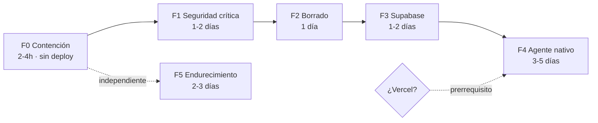

# Plan de Limpieza y Migración

Plan de ejecución en 5 fases. Cada fase es **desplegable de forma independiente** y deja el sitio en un estado funcional. No hay big bang.

**Regla de oro del plan:** ninguna fase depende de la siguiente para aportar valor. Si el proyecto se detiene después de la Fase 1, el sitio ya quedó mejor que hoy.

---

## Resumen ejecutivo

| Fase | Qué resuelve | Duración | Riesgo | Requiere deploy |
|---|---|---|---|---|
| **F0** | Contención — para el sangrado hoy | 2-4 h | Bajo | No (solo n8n + rotar claves) |
| **F1** | Fraude de checkout + webhooks abiertos | 1-2 días | Medio | Sí |
| **F2** | Borrado de código muerto | 1 día | Bajo | Sí |
| **F3** | Base de datos y sesiones unificadas | 1-2 días | Bajo | No (solo Supabase) |
| **F4** | Agente Alma nativo con streaming | 3-5 días | Medio | Sí |
| **F5** | Endurecimiento y calidad | 2-3 días | Bajo | Sí |

**Prerrequisito de la F4:** decisión de hosting. Ver [ADR-001](./07-adr-001-donde-vive-el-agente.md).

---

## FASE 0 — Contención inmediata

> **Objetivo:** frenar el daño que está ocurriendo ahora mismo. No toca el código del sitio.
> **Se puede hacer hoy, sin deploy.**

### F0.1 — Arreglar `buscar_producto` en n8n 🔴

El nodo apunta a `https://TU-WORDPRESS.com/wp-json/wc/v3/products` — el placeholder del template, sin reemplazar. **Alma inventó todos los datos de producto desde que está en producción.**

- [ ] Cambiar la URL a `https://joyeriabd.a380.com.br/wp-json/wc/v3/products`
- [ ] Mover `consumer_key` / `consumer_secret` de query string a **header** `Authorization: Basic base64(ck:cs)` — en query string quedan en logs de n8n, access logs de WordPress y cualquier proxy
- [ ] Dar valores fijos a `per_page` (`5`), `status` (`publish`) y `_fields` (`id,name,price,sku,stock_status,permalink`). Hoy no tienen valor, lo que significa que **los rellena el modelo**
- [ ] Dejar que el modelo rellene **solo** `search`
- [ ] Corregir `placeholderDefinitions`: define `searchQuery` pero el parámetro se llama `search`

**Verificación:** preguntarle a Alma por un producto real y comparar el precio contra WooCommerce.

### F0.2 — Arreglar la pausa en canal web 🔴

`🔍 Check Pausa` filtra `chat_handoff.client_phone = {{ $json.sessionId }}`. En web el `sessionId` es `web_<timestamp>` — nunca matchea. **La asesora no puede tomar el control de una conversación web.**

- [ ] Agregar columna `session_key` a `chat_handoff` (o filtrar por `client_phone OR session_key`)
- [ ] En `📋 Prep Web`, emitir `sessionKey = 'web:' + sessionId`; en `📋 Prep WA`, `sessionKey = 'wa:' + phoneNumber`
- [ ] Filtrar por `session_key`

> Es un parche. La solución definitiva es la tabla `chat_sessions` de la Fase 3.

### F0.3 — Escapar el JSON de las tools 🟠

`guardar_prospecto` y `notificar_vendedor` arman JSON con templates de string. Una comilla doble o un salto de línea en `{resumen}` o `{notas}` produce JSON inválido y **el lead se pierde en silencio**.

- [ ] Reemplazar `specifyBody: json` con template plano por el modo de campos, o interponer un nodo Code que serialice con `JSON.stringify()`

### F0.4 — Cerrar `alma-actions` 🟠

Webhook sin autenticación. Cualquiera con la URL llena el CRM de prospectos falsos y dispara WhatsApps al vendedor.

- [ ] Header `X-Webhook-Token` con un secreto compartido; rechazar 401 sin él
- [ ] Lo mismo para `alma-web` y `alma-wa` (cada POST cuesta tokens de OpenAI)
- [ ] Rate limit básico por IP

### F0.5 — Rotar credenciales 🔴

- [ ] **`DIFY_API_KEY`** — el `README.md:61` documenta que estuvo hardcodeada en Base64 en `settings.ts`. Base64 no es cifrado. Asumila comprometida
- [ ] Auditar el historial: `git log -p -- src/lib/settings.ts`, o `gitleaks detect --no-git=false`
- [ ] Si el repo es público o estuvo público: rotar también `WOO_CONSUMER_KEY`/`SECRET`

### F0.6 — Resolver el marcador del prompt 🟡

El system prompt contiene literalmente `[PROMPT DETALLADO SE CONFIGURA EN FASE 2]`. Nunca se configuró.

- [ ] Reemplazar por el prompt completo de [03-agente-alma.md](./03-agente-alma.md) §2

**Salida de la F0:** Alma deja de inventar precios, la asesora puede tomar el control, los leads dejan de perderse y los webhooks dejan de ser gratis. Sin tocar el sitio.

---

## FASE 1 — Seguridad crítica del sitio

> **Objetivo:** cerrar los tres agujeros que exponen dinero y datos de clientes.
> **Detalle completo de cada hallazgo en [04-auditoria-seguridad.md](./04-auditoria-seguridad.md).**

### F1.1 — Checkout server-side (SEC-01) 🔴

`src/lib/checkout.ts` **no tiene `'use server'`** y se importa desde `src/components/buy-button.tsx` (`'use client'`). El `fetch` corre en el navegador con `amount` y `unit_price` en el payload, contra un webhook n8n sin autenticación.

> Un `curl` con `amount: 1` devuelve un link de pago legítimo de Mercado Pago por una alianza de 3.000 USD.

- [ ] Crear `src/app/api/checkout/route.ts` (server-only)
- [ ] Recibe **solo** `{ productId, quantity, buyer }` — nunca precio
- [ ] Resuelve el precio con `fetchWooCommerce('products/' + productId)`
- [ ] Llama a n8n con `X-Webhook-Token`
- [ ] En n8n: **rechazar cualquier request sin token y re-validar el monto contra WooCommerce**
- [ ] `buy-button.tsx` pasa a llamar a `/api/checkout`
- [ ] Borrar `src/lib/checkout.ts`

**Verificación:** `curl` directo al webhook con `amount: 1` debe devolver 401.

### F1.2 — Firma HMAC en `/api/webhook` (SEC-02) 🔴

Cualquiera puede inyectar mensajes en el chat de un cliente atribuidos a "Alma" — vector de phishing de pagos.

- [ ] En n8n: `HMAC-SHA256(rawBody, N8N_WEBHOOK_SECRET)` en header `X-Signature`
- [ ] En la ruta: `await req.text()`, recalcular, comparar con `crypto.timingSafeEqual`, 401 si no coincide
- [ ] Quitar el `console.log` que imprime teléfono y mensaje en claro
- [ ] Corregir el `senderName` por defecto: hoy es `'Maya'`, debería ser `'Alma'`

### F1.3 — Cerrar el IDOR de `/api/messages` (SEC-03) 🔴

`GET /api/messages?phone=598...` devuelve los mensajes de cualquier teléfono, y `consume()` los **borra** — el cliente legítimo nunca los recibe. Los celulares uruguayos son enumerables.

- [ ] Token de sesión opaco generado server-side, en cookie `httpOnly`
- [ ] La clave del store pasa a ser el token, **nunca** el teléfono
- [ ] El webhook entrante resuelve teléfono → token vía tabla server-side

> Se resuelve definitivamente en la Fase 3. Si la F3 va inmediatamente después, este parche se puede saltear.

### F1.4 — Sanitizar HTML de WooCommerce (SEC-05) 🟠

`src/app/products/[id]/page.tsx:86` inyecta la descripción con `dangerouslySetInnerHTML` sin sanitizar. `src/lib/mappers.ts` además reinyecta el `src` capturado por regex sin escapar.

- [ ] `npm i isomorphic-dompurify`
- [ ] Sanitizar **server-side**, allowlist: `p, br, ul, li, strong, em, video, source, a`
- [ ] Validar que `src`/`href` sean `https:`

---

## FASE 2 — Borrado de código muerto

> **Objetivo:** eliminar los 4 caminos de chat huérfanos y las dependencias sin usar.
> Cada archivo borrado es superficie de ataque que desaparece.

### F2.1 — Rutas y acciones a eliminar

```
src/app/api/dify-chat/route.ts          ← Dify ya no se usa
src/app/api/alma-chat/route.ts          ← ⚠️ ver nota
src/app/api/send-message/route.ts       ← marcado [LEGACY]
src/app/actions/chat.ts                 ← marcado [LEGACY], filtra webhook + PII
src/app/api/chat/webhook/route.ts       ← 301 sin header Location, no redirige nada
```

> ⚠️ **`/api/alma-chat` sí tiene consumidor**: `chat-widget.tsx:241`. Lo que pasa es que `<ChatWidget />` está comentado en `layout.tsx:10`. **Borrala solo cuando el widget apunte a `/api/agent` (Fase 4).** Hasta entonces, dejala pero protegida con rate limit.

### F2.2 — Widget `@n8n/chat` del layout

`src/app/layout.tsx:50-81` importa desde jsDelivr **sin versión fijada**. Una versión comprometida ejecuta código arbitrario en todas las páginas, incluida la de checkout.

- [ ] Fijar la versión exacta **ya** (`@n8n/chat@1.x.y`) como medida temporal
- [ ] Borrar el bloque completo en la Fase 4, al montar `<ChatWidget />`

### F2.3 — Partir `settings.ts`

Hoy `appSettings` se importa desde componentes cliente (`chat-widget.tsx:4`, `footer.tsx:8`) → **las 4 URLs de webhook n8n viajan en el bundle JS público**.

- [ ] `settings.client.ts` → `whatsAppNumber`, `chatAgentName`, `siteUrl`
- [ ] `settings.server.ts` → todas las URLs de webhook, leídas de `process.env` **sin fallback hardcodeado**, con `throw` si faltan
- [ ] Eliminar: `difyApiKey`, `difyBaseUrl`, `n8nEventWebhookUrl`, `almaWebhookUrl`, `n8nWebhookUrl`
- [ ] **Unificar el número de WhatsApp**: `settings.ts:8` dice `59895435644` y `whatsapp.ts:20` dice `59891264956`. Son distintos

### F2.4 — Dependencias huérfanas

13 paquetes instalados sin un solo import. Peso de instalación y superficie de supply-chain gratis.

```bash
npm uninstall @dnd-kit/core @dnd-kit/sortable @dnd-kit/utilities \
  @mediapipe/camera_utils @mediapipe/hands @mediapipe/drawing_utils \
  three @types/three wav firebase date-fns @hookform/resolvers @genkit-ai/next
npx depcheck   # confirmar
```

- [ ] Borrar `src/lib/firebase.ts` (stub inerte de 9 líneas)
- [ ] Decidir sobre `src/lib/supabase.ts`: **cero imports en `src/`**. El dashboard `/admin/orders` del README no existe en este árbol. O se implementa, o se borra
- [ ] **No borrar `zod`** — se usa en la Fase 4
- [ ] **No borrar `tailwindcss-animate`** — sí se usa, desde `tailwind.config.ts:92`

### F2.5 — Documentación

- [ ] Reemplazar `RUNBOOK.md` por [06-runbook.md](./06-runbook.md) — el viejo describe un flujo Dify que ya no corre y documenta env vars `WC_*` que el código no lee (lee `WOO_*`)
- [ ] Corregir el `README.md`: quitar la mención al fallback Base64 y al dashboard inexistente
- [ ] Crear `.env.example` versionado

---

## FASE 3 — Base de datos y sesiones

> **Objetivo:** una sola identidad de conversación para web y WhatsApp. Sin esto, la Fase 4 no puede funcionar bien.
> **No requiere deploy del sitio** — es trabajo de Supabase.

### F3.1 — Tablas

Esquema completo en [01-arquitectura.md](./01-arquitectura.md) §3. Resumen:

```sql
chat_sessions   -- session_key 'web:<token>' | 'wa:<telefono>', canal,
                -- telefono, nombre, is_paused, resume_at
chat_messages   -- session_id, rol, contenido, tokens_in, tokens_out
chat_prospects  -- los mismos campos que ya usa el workflow n8n
```

- [ ] Crear las tres tablas con **RLS activo**
- [ ] Índice en `chat_sessions(telefono)` — permite unificar el hilo cuando el cliente empieza en web y deja su WhatsApp
- [ ] Migrar los datos de `chat_handoff` a `chat_sessions`
- [ ] Verificar RLS en `orders` / `order_items` (la anon key es pública por diseño; sin RLS, cualquiera consulta PostgREST)

### F3.2 — Retirar `messageStore`

`src/lib/messageStore.ts` es un `Map` en memoria del proceso. Se pierde en cada reinicio, se parte con múltiples instancias, y no tiene tope de teléfonos — **es alimentable desde afuera sin auth vía `/api/webhook`, lo que conecta directamente con los 503 por memoria del RUNBOOK §5**.

- [ ] Reemplazar por `chat_messages` en Supabase
- [ ] TTL de 24 h vía `pg_cron`
- [ ] Borrar `src/lib/messageStore.ts`

---

## FASE 4 — Agente Alma nativo

> **⚠️ PRERREQUISITO — decisión de hosting.**
> Un loop de tool calling con streaming SSE en Hostinger shared, que ya se cae por memoria (RUNBOOK §5), es pedir problemas.
> - **Vercel** → adelante con esta fase.
> - **Hostinger shared** → **no ejecutar la F4**. Quedarse con el agente en n8n (ya arreglado en la F0) hasta migrar el hosting.
>
> Ver [ADR-001](./07-adr-001-donde-vive-el-agente.md).

### F4.1 — Núcleo (spec completa en [03-agente-alma.md](./03-agente-alma.md))

```
src/lib/agent/prompt.ts       ← system prompt versionado en Git
src/lib/agent/tools.ts        ← las 3 tools con schemas zod
src/lib/agent/memory.ts       ← carga/persistencia en Supabase
src/lib/agent/session.ts      ← session_key, isPaused()
src/app/api/agent/route.ts    ← el endpoint
```

Orden obligatorio dentro del route handler:

```
validar zod → rate limit → verificar Origin → cargar historial de Supabase
→ chequear pausa → loop de tool calling (máx 8 iteraciones) → stream SSE
→ persistir mensajes y tokens
```

- [ ] `buscar_producto` llama a `fetchWooCommerce()` **en proceso** — sin HTTP, sin credenciales en query string, aprovechando la caché de 2 min y la deduplicación de requests que `woocommerce.ts` ya tiene
- [ ] Mantener **exactamente** los mismos nombres de campo del workflow n8n (`nombre`, `producto`, `para_quien`, `ocasion`, `urgencia`, `canal`, `notas`, `resumen`) — el prompt ya está afinado para ellos
- [ ] El historial se lee **siempre** de Supabase, **nunca** del payload del cliente
- [ ] `process.env.CHAT_MODEL` — el modelo no se hardcodea
- [ ] Cero campos `debug` en producción

### F4.2 — Frontend

- [ ] Descomentar `<ChatWidget />` en `layout.tsx:10`
- [ ] Borrar el bloque `@n8n/chat` (`layout.tsx:50-81`)
- [ ] En `chat-widget.tsx`: quitar el panel de debug y el estado `debugLogs`, reemplazar el polling a `/api/messages` por consumo del stream SSE, cambiar la clave de sesión de `web_${phone}` a token opaco

### F4.3 — Convivencia y corte

El corte es gradual, con los dos sistemas corriendo en paralelo:

1. **Solo el widget web** apunta a `/api/agent`. WhatsApp sigue en el n8n viejo, intacto
2. Comparar durante 1-2 semanas con datos reales: latencia, calidad de respuesta, leads generados
3. Si la web anda mejor: n8n pasa a **puente tonto** — el webhook `alma-wa` recibe, postea a `/api/agent` con `canal: 'whatsapp'` y header `X-Agent-Token`, devuelve la respuesta
4. Borrar del workflow n8n: el nodo Agent, el nodo de OpenAI, la memoria y las 3 tools. Quedan solo los webhooks y los efectos asíncronos

---

## FASE 5 — Endurecimiento y calidad

> **Objetivo:** que el próximo bug lo agarre el build y no un cliente.

### F5.1 — Recuperar las barreras del build

`next.config.ts:9,13` desactiva TypeScript y ESLint en el build. Sumado a que **`eslint` ni siquiera está en `devDependencies`** (`npm run lint` no puede correr) y a que no hay un solo test: **cero verificación entre un commit y producción**.

- [ ] `npm i -D eslint eslint-config-next` + `eslint.config.mjs` extendiendo `next/core-web-vitals`
- [ ] `"typecheck": "tsc --noEmit"` en scripts
- [ ] `ignoreBuildErrors: false` y corregir la lista de errores (esperá decenas, casi todos por `any` y por los `params` de Next 15 que ahora son `Promise`)
- [ ] Verificar `"strict": true` en `tsconfig.json`
- [ ] Dejar `ignoreDuringBuilds: true` para ESLint solo si bloquea el deploy. **Nunca para TypeScript**

### F5.2 — Validación y límites

- [ ] `zod` en las 9 rutas con `safeParse`. Hoy está instalado con **cero imports**
- [ ] `per_page` con `z.coerce.number().int().min(1).max(100)` — hoy `per_page=99999` se reenvía tal cual a WooCommerce
- [ ] `photoDataUri` en `/api/virtual-tryon` con tope de tamaño y prefijo `data:image/` — hoy acepta strings arbitrarias y las reenvía con 90 s de timeout
- [ ] `jewelryType` con `z.enum(['necklace','earrings','ring'])`
- [ ] Rate limiting en `middleware.ts` para `/api/*`: 10/min para chat, 3/5min para virtual-tryon

### F5.3 — Cabeceras de seguridad

`middleware.ts` solo hace modo mantenimiento. No hay CSP, HSTS, `X-Content-Type-Options` ni `Referrer-Policy`.

- [ ] Bloque `async headers()` en `next.config.ts`
- [ ] CSP (deberá permitir `cdn.jsdelivr.net` mientras el widget n8n siga en el layout)
- [ ] `Retry-After` y `Cache-Control: no-store` en la respuesta 503 de mantenimiento

### F5.4 — Rendimiento

- [ ] `images.unoptimized: true` en un sitio donde las fotos **son** el producto: sin WebP/AVIF ni redimensionado responsive. Si el hosting no soporta `sharp`, usar loader externo en vez de desactivar la optimización
- [ ] Caché: categorías con `s-maxage=3600` (hoy `no-store`, y cambian una vez por trimestre); listado con `s-maxage=60`
- [ ] Acotar el fallback a caché expirada de `woocommerce.ts:125` a 1 h — hoy sirve datos viejos **indefinidamente** tras un fallo de red, y puede mostrar precios desactualizados
- [ ] `dynamic import` para Three.js / MediaPipe

### F5.5 — Higiene pendiente

- [ ] Prompt injection en `src/ai/flows/personalized-recommendations.ts`: triple llave Handlebars (`{{{...}}}`) = sin escapar, con input de textarea libre y sin tope de longitud. Pasar a doble llave + `.max(500)`
- [ ] `src/ai/flows/virtual-try-on.ts` está huérfano (el componente llama a `/api/virtual-tryon` → n8n). Decidir: Genkit o n8n, no ambos
- [ ] `/api/health` no necesita exponer `NODE_ENV`
- [ ] Restringir `NEXT_PUBLIC_GOOGLE_MAPS_KEY` por HTTP referrer en Google Cloud Console

---

## Orden recomendado y dependencias



- **F0 se puede hacer hoy** y no depende de nada.
- **F5 es independiente** — se puede intercalar en cualquier momento.
- **F4 está bloqueada** por la decisión de hosting.
- F1 → F2 → F3 → F4 sí es secuencial.

---

## Criterios de aceptación

Cada fase se cierra cuando estos tests pasan.

| # | Test | Fase |
|---|---|---|
| 1 | Preguntar por un producto real → el precio coincide con WooCommerce | F0 |
| 2 | Preguntar por un producto inexistente → no inventa, ofrece derivar | F0 |
| 3 | Pausar una sesión **web** → Alma se calla | F0 |
| 4 | Forzar comillas dobles en `resumen` → el lead se guarda igual | F0 |
| 5 | `POST` al webhook de checkout con `amount: 1` → 401 | F1 |
| 6 | `POST` a `/api/webhook` sin firma → 401 | F1 |
| 7 | `GET /api/messages?phone=<ajeno>` → 401/403 | F1 |
| 8 | Producto con `` en la descripción → no ejecuta | F1 |
| 9 | `grep -r "n8n.axion380" .next/static/` → sin resultados | F2 |
| 10 | Reiniciar el backend a mitad de conversación → el historial sobrevive | F3 |
| 11 | Cliente empieza en web, deja su WhatsApp → un solo hilo | F3 |
| 12 | Cortar n8n → el chat web sigue funcionando | F4 |
| 13 | Primer token del stream en < 1 s | F4 |
| 14 | 50 requests seguidas a `/api/agent` → el rate limit corta | F4/F5 |
| 15 | `npx tsc --noEmit` → sin errores | F5 |

---

## Riesgos del plan

| Riesgo | Probabilidad | Mitigación |
|---|---|---|
| La F5.1 destapa decenas de errores de tipo y frena todo | **Alta** | Correr `npx tsc --noEmit` **antes** de planificar la fase, para dimensionar. Es diagnóstico gratis |
| La F4 en Hostinger genera 503 por memoria | Alta si no se migra | Es el prerrequisito explícito. No arrancar la F4 sin resolverlo |
| Borrar `/api/alma-chat` rompe el widget al descomentarlo | Media | Borrarla solo en la F4.3, cuando el widget ya apunte a `/api/agent` |
| El equipo no técnico pierde la edición visual del prompt | Media | Prompt en tabla `agent_config` de Supabase + página de admin mínima. Contar el trabajo extra |
| Regresión de calidad conversacional al migrar el prompt | Media | Por eso la F4.3 corre los dos sistemas en paralelo antes de cortar |
| El webhook `ja-checkout` ya re-valida el monto y la F1.1 es menos urgente | Baja | Verificar el workflow. **El fallo de arquitectura persiste igual** — el precio no debe salir del navegador |

---

## Documentos relacionados

- [01-arquitectura.md](./01-arquitectura.md) — AS-IS, TO-BE y modelo de datos
- [03-agente-alma.md](./03-agente-alma.md) — spec del agente, prompt y tools
- [04-auditoria-seguridad.md](./04-auditoria-seguridad.md) — los 21 hallazgos con detalle
- [05-diagnostico-n8n.md](./05-diagnostico-n8n.md) — bugs del workflow actual
- [06-runbook.md](./06-runbook.md) — operación y variables de entorno
- [07-adr-001-donde-vive-el-agente.md](./07-adr-001-donde-vive-el-agente.md) — la decisión de arquitectura
