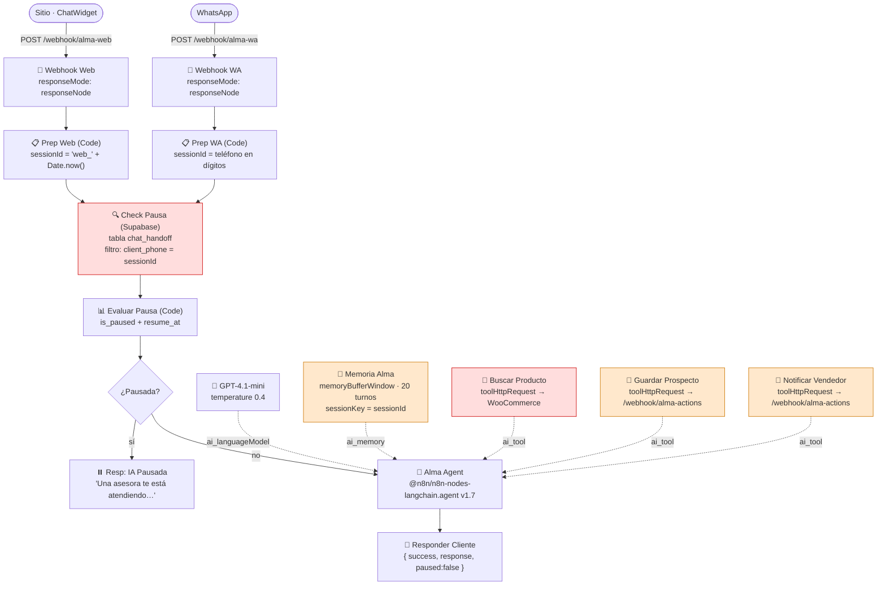

# Diagnóstico del workflow n8n de Alma

Este documento describe el workflow n8n que hoy corre en producción como agente
conversacional "Alma", enumera sus defectos ordenados por gravedad, y separa
explícitamente lo que hay que conservar de lo que hay que reescribir.

El destino de la migración está en `03-agente-alma.md`. Este documento es el punto
de partida: qué existe y qué está roto.

---

## 1. Qué hace el workflow

### 1.1 Vista general

Un solo agente atiende dos canales. Cada canal entra por su propio webhook,
se normaliza en un nodo Code, se consulta si la conversación está pausada
(porque una asesora humana tomó el control), y si no lo está se ejecuta el
agente LangChain con modelo, memoria y tres herramientas.



### 1.2 Nodo por nodo

| # | Nodo | Tipo | Qué hace |
|---|---|---|---|
| 1 | 🎯 Webhook Web | `n8n-nodes-base.webhook` | `POST /webhook/alma-web`, `responseMode: responseNode`. Recibe `{ mensaje, sessionId, senderName, canal, productoContexto }` desde el sitio. |
| 2 | 📋 Prep Web | `n8n-nodes-base.code` | Normaliza el body. Genera `sessionId` con `'web_' + Date.now()` si no viene uno. Fija `canal: 'web'`. |
| 3 | 🎯 Webhook WA | `n8n-nodes-base.webhook` | `POST /webhook/alma-wa`. Entrada del canal WhatsApp. |
| 4 | 📋 Prep WA | `n8n-nodes-base.code` | Normaliza el body. `sessionId = String(phoneNumber).replace(/[^0-9]/g,'')` — es decir, **el teléfono en dígitos**. Fija `canal: 'whatsapp'`. |
| 5 | 🔍 Check Pausa | `n8n-nodes-base.supabase` | `getAll` sobre la tabla `chat_handoff`, `limit: 1`, filtro `client_phone eq {{ $json.sessionId }}`. Tiene `alwaysOutputData: true` para no cortar el flujo cuando no hay fila. |
| 6 | 📊 Evaluar Pausa | `n8n-nodes-base.code` | Recupera el item original de Prep Web o Prep WA con un `try/catch`, y calcula `isPaused = is_paused && (!resume_at \|\| resume_at > now)`. |
| 7 | ¿Pausada? | `n8n-nodes-base.if` | Bifurca según `$json.isPaused === true`. |
| 8 | ⏸️ Resp: IA Pausada | `respondToWebhook` | Devuelve `{ success: true, response: 'En este momento una asesora te está atendiendo personalmente…', paused: true }`. El agente no se ejecuta. |
| 9 | 🤖 Alma Agent | `@n8n/n8n-nodes-langchain.agent` v1.7 | El agente. Recibe el `systemMessage` con la personalidad, el embudo de venta y las reglas de formato. |
| 10 | 🧠 GPT-4.1-mini | `lmChatOpenAi` | Modelo `gpt-4.1-mini`, `temperature: 0.4`. |
| 11 | 💾 Memoria Alma | `memoryBufferWindow` | `sessionIdType: customKey`, `sessionKey = {{ $json.sessionId }}`, `contextWindowLength: 20`. |
| 12 | 🔧 Buscar Producto | `toolHttpRequest` | GET a la REST API de WooCommerce (`/wp-json/wc/v3/products`). |
| 13 | 🔧 Guardar Prospecto | `toolHttpRequest` | POST a `https://n8n.axion380.com.br/webhook/alma-actions` con `action: save_prospect`. |
| 14 | 🔧 Notificar Vendedor | `toolHttpRequest` | POST al mismo `alma-actions` con `action: notify_seller`. |
| 15 | 💬 Responder Cliente | `respondToWebhook` | Devuelve `{ success: true, response: $json.output \|\| $json.text \|\| '', paused: false }`. |

### 1.3 Cómo lo consume el sitio hoy

El widget React (`src/components/chat-widget.tsx`) no habla con n8n directamente:
postea a `/api/alma-chat`, que reenvía a n8n con `AbortSignal.timeout(45000)` y
comenta en el propio código que "n8n + GPT puede tardar ~10-20s". El widget usa
un `sessionId` propio con formato `web_<telefono>` o `web_anon_<timestamp>`
(`chat-widget.tsx:66,73,200,216`). Ninguno de esos formatos es un teléfono en
dígitos, lo cual es el origen del bug #2.

---

## 2. Bugs encontrados

Ordenados por gravedad. 🔴 = rompe el producto hoy · 🟠 = pérdida de datos o
superficie de ataque · 🟡 = deuda de calidad y riesgo de marca.

---

### 🔴 #1 — La tool `buscar_producto` nunca funcionó

**Severidad:** crítica
**Nodo afectado:** 🔧 Buscar Producto (`toolHttpRequest`)

**Evidencia**

```json
{
  "name": "🔧 Buscar Producto",
  "type": "@n8n/n8n-nodes-langchain.toolHttpRequest",
  "url": "https://TU-WORDPRESS.com/wp-json/wc/v3/products",
  "parametersQuery": ["search", "per_page", "status", "_fields",
                      "consumer_key", "consumer_secret"]
}
```

`https://TU-WORDPRESS.com` es el placeholder del template de n8n, sin reemplazar.
Ese dominio no existe. La URL real del WooCommerce se lee en el sitio desde
`WOO_BASE_URL` (`src/lib/woocommerce.ts:11`), pero nunca se copió al workflow.

Hay tres defectos más en el mismo nodo:

1. **Ningún parámetro tiene `value`.** En `toolHttpRequest`, un parámetro sin
   valor definido significa *que lo rellena el modelo*. El workflow le está
   pidiendo al LLM que adivine `consumer_key` y `consumer_secret`.
2. **Las credenciales van en query string.** Aunque tuvieran valor,
   `consumer_key`/`consumer_secret` como parámetros de URL quedan escritos en los
   logs de ejecución de n8n, en los access logs de WordPress y en cualquier proxy
   intermedio. WooCommerce acepta `Authorization: Basic`, que es donde tienen que
   ir — de hecho es exactamente lo que ya hace `woocommerce.ts:94-101`.
3. **`placeholderDefinitions` define `searchQuery`, pero el parámetro se llama
   `search`.** El placeholder no se usa en ningún lado; es código muerto que
   sugiere que la tool fue configurada sin probarse nunca.

**Consecuencia de negocio**

Cada vez que Alma habló de un producto, de un precio, de un material o de un
stock, **lo inventó**. No hubo una sola respuesta con datos reales del catálogo.

La regla del system prompt "nunca inventes datos de productos que no tengas" es
inaplicable por construcción: desde el punto de vista del modelo, no existe
diferencia observable entre "no tengo el dato" y "la tool falló". Con la tool
apuntando a un dominio inexistente, el modelo recibe un error y completa el hueco
con lo más plausible. En una boutique que vende alianzas de 3.000 USD con
certificación, eso es un reclamo esperando a ocurrir.

**Fix**

- Inmediato, en n8n (5 minutos): poner la URL real de WordPress, fijar los
  valores de `search`, `per_page`, `status` y `_fields`, y mover las credenciales
  a un credential de tipo Basic Auth. Esto detiene la invención de precios **hoy**,
  sin esperar a la migración.
- Definitivo: la tool pasa a llamar a `fetchWooCommerce()` en proceso, sin HTTP
  intermedio, sin credenciales expuestas, y aprovechando la caché de 2 minutos y
  la deduplicación de requests que `woocommerce.ts` ya implementa
  (`TTL_MS = 120_000`, `pendingRequests`). Ver `03-agente-alma.md` §3.
- Además: cuando la tool falla, tiene que devolver un error **distinguible** para
  que el modelo diga "no puedo verificarlo en este momento" en vez de improvisar.

---

### 🔴 #2 — La pausa (handoff humano) no funciona en el canal web

**Severidad:** crítica
**Nodo afectado:** 🔍 Check Pausa (Supabase)

**Evidencia**

```json
{
  "name": "🔍 Check Pausa",
  "type": "n8n-nodes-base.supabase",
  "parameters": {
    "operation": "getAll",
    "tableId": "chat_handoff",
    "limit": 1,
    "filters": { "conditions": [
      { "keyName": "client_phone", "condition": "eq",
        "keyValue": "={{ $json.sessionId }}" }
    ]}
  }
}
```

El filtro compara una columna llamada `client_phone` contra el `sessionId`. Eso
solo tiene sentido en un canal:

| Canal | `sessionId` generado en Prep | ¿Matchea `client_phone`? |
|---|---|---|
| WhatsApp | `String(phoneNumber).replace(/[^0-9]/g,'')` → `598…` | Sí |
| Web | `'web_' + Date.now()` → `web_1730000000000` | **Nunca** |

Y el widget del sitio empeora el desajuste: usa `web_${phone}` o
`web_anon_${Date.now()}` (`chat-widget.tsx:66,73`). Ninguna de esas dos formas es
un teléfono en dígitos, así que la query siempre devuelve vacío.

**Consecuencia de negocio**

En el sitio, **una asesora no puede tomar el control de la conversación**. Marca
`is_paused = true` en `chat_handoff` y Alma la ignora: le sigue pisando los
mensajes al vendedor humano mientras este intenta cerrar. Es exactamente el
momento de mayor valor de la conversación — intención de compra declarada, ticket
de miles de dólares — y es el único momento en el que el sistema no obedece.

Un problema derivado: si el mismo cliente empieza en la web y después escribe por
WhatsApp, son dos hilos que no se conocen. Pausar uno no pausa el otro.

**Fix**

Unificar la clave de sesión y buscar la pausa por esa clave, no por el teléfono:

```sql
create table chat_sessions (
  id            uuid primary key default gen_random_uuid(),
  session_key   text unique not null,      -- 'web:<token_opaco>' | 'wa:<telefono>'
  canal         text not null check (canal in ('web','whatsapp')),
  telefono      text,                       -- se llena cuando Alma lo obtiene
  nombre        text,
  is_paused     boolean default false,      -- ← la asesora tomó el control
  resume_at     timestamptz,
  created_at    timestamptz default now(),
  last_seen_at  timestamptz default now()
);
create index on chat_sessions (telefono);
```

La pausa se consulta por `session_key` **o** por `telefono`. Así, cuando el
cliente empieza en la web y deja su WhatsApp, la asesora pausa una sola
conversación y queda pausada en los dos canales. Detalle en `03-agente-alma.md` §5.

---

### 🟠 #3 — Los tools rompen con comillas dobles (JSON roto por template de strings)

**Severidad:** alta
**Nodos afectados:** 🔧 Guardar Prospecto y 🔧 Notificar Vendedor

**Evidencia**

```json
"jsonBody": "{\"action\": \"save_prospect\", \"sessionId\": \"{sessionId}\", \"nombre\": \"{nombre}\", \"producto\": \"{producto}\", \"para_quien\": \"{paraQuien}\", \"ocasion\": \"{ocasion}\", \"urgencia\": \"{urgencia}\", \"canal\": \"{canal}\", \"notas\": \"{notas}\"}"
```

```json
"jsonBody": "{\"action\": \"notify_seller\", \"sessionId\": \"{sessionId}\", \"nombre\": \"{clientName}\", \"producto\": \"{producto}\", \"resumen\": \"{resumen}\", \"canal\": \"{canal}\", \"urgencia\": \"{urgencia}\"}"
```

El cuerpo se arma por **sustitución textual** de placeholders dentro de un string.
`{notas}` y `{resumen}` son texto libre generado por el modelo. Si el modelo
escribe:

> Quiere la alianza "Eterna" de 18k

el JSON resultante queda:

```json
"resumen": "Quiere la alianza "Eterna" de 18k"
```

JSON inválido. Lo mismo con un salto de línea, una barra invertida o un emoji mal
codificado. El propio JSON del workflow lo marca:

```json
"_BUG": "Template de string: comillas o saltos de linea en {notas} rompen el JSON."
```

**Consecuencia de negocio**

**El lead se pierde en silencio.** La tool falla, el agente sigue conversando como
si nada, el cliente se despide contento y el vendedor nunca se entera de que
existió. No hay alerta, no hay reintento, no hay registro. Y el disparador es
justamente el lenguaje natural de una conversación de joyería, donde citar el
nombre de una pieza entre comillas es lo normal. No es cuestión de si pasa: es
cuestión de cuántas veces ya pasó.

**Fix**

Que el JSON lo serialice el runtime, no un template. Con el SDK de tool calling,
el modelo emite argumentos estructurados validados con zod y el `JSON.stringify`
lo hace el proceso. El bug desaparece por construcción, sin necesidad de escapar
nada a mano. Ver `03-agente-alma.md` §3.

Mitigación en n8n mientras tanto: usar expresiones de n8n con
`{{ JSON.stringify($fromAI('notas')) }}` en vez de interpolación cruda.

---

### 🟠 #4 — La memoria vive en la RAM del proceso de n8n

**Severidad:** alta
**Nodo afectado:** 💾 Memoria Alma (`memoryBufferWindow`)

**Evidencia**

```json
{
  "name": "💾 Memoria Alma",
  "type": "@n8n/n8n-nodes-langchain.memoryBufferWindow",
  "sessionIdType": "customKey",
  "sessionKey": "={{ $json.sessionId }}",
  "contextWindowLength": 20
}
```

`memoryBufferWindow` guarda las últimas 20 interacciones en un buffer **en memoria
del proceso de n8n**. No hay persistencia.

**Consecuencia de negocio**

- Un redeploy, un OOM o un restart y **todas las conversaciones activas arrancan
  de cero**. El cliente que ya dio su nombre, su ocasión y su presupuesto tiene
  que repetir todo. En la práctica, se va.
- Con dos instancias de n8n detrás de un balanceador, cada una tiene su mitad del
  historial. Alma responde con amnesia intermitente según a qué instancia le tocó
  el mensaje.
- El `RUNBOOK.md` del proyecto ya documenta caídas por memoria, así que el
  escenario no es hipotético.

Lo llamativo: el mismo workflow ya tiene Supabase conectado (nodo Check Pausa).
No hay ninguna razón técnica para no persistir el historial ahí.

**Fix**

Tabla `chat_messages` en Supabase, con lectura de los últimos 20 turnos por
`session_key` al inicio de cada request. Mismo tamaño de ventana, pero
sobrevive a reinicios y funciona con N instancias. Ver `03-agente-alma.md` §4.

---

### 🟠 #5 — Los tres webhooks están abiertos al mundo

**Severidad:** alta
**Nodos afectados:** 🎯 Webhook Web, 🎯 Webhook WA, y el endpoint `alma-actions`
que consumen las tools 🔧 Guardar Prospecto y 🔧 Notificar Vendedor.

**Evidencia**

```json
{ "name": "🔧 Guardar Prospecto",
  "method": "POST",
  "url": "https://n8n.axion380.com.br/webhook/alma-actions",
  "_BUG": "… Webhook sin autenticacion." }
```

```json
{ "name": "🎯 Webhook Web", "parameters": {
    "httpMethod": "POST", "path": "alma-web", "responseMode": "responseNode" } }
```

Ninguno de los tres declara autenticación, ni token, ni firma HMAC, ni
verificación de origen, ni rate limit. La URL de `alma-actions` está escrita en
claro dentro del JSON del workflow, y ese JSON circuló por chat. La de `alma-web`
está además en `src/lib/settings.ts:12` dentro de `appSettings`, que se importa
desde componentes cliente — o sea, viaja en el bundle JS público.

**Consecuencia de negocio**

Cualquiera que conozca las URLs puede:

- **Inundar el CRM de prospectos falsos** posteando a `alma-actions` con
  `action: save_prospect`. El equipo de ventas pierde la capacidad de distinguir
  un lead real de basura.
- **Disparar notificaciones de WhatsApp al vendedor a voluntad**, con
  `action: notify_seller`. Denegación de servicio contra una persona.
- **Quemar presupuesto de OpenAI** posteando a `alma-web` o `alma-wa` en bucle.
  Cada POST ejecuta el agente completo con tool calling. La factura no tiene tope.

**Fix**

- `alma-actions` deja de existir como endpoint público: las acciones pasan a ser
  funciones en proceso (INSERT en Supabase). La única llamada saliente que queda
  es la notificación al vendedor, fire-and-forget, con `X-Agent-Token` en header.
- El endpoint del agente valida `Origin` contra el dominio de la boutique y aplica
  rate limit por IP + sesión.
- El puente de WhatsApp (n8n → sitio) se autentica con un token compartido en
  header.

Ver `03-agente-alma.md` §6.

---

### 🟡 #6 — Sin streaming: 10-20 segundos de pantalla en blanco

**Severidad:** media
**Nodos afectados:** 🎯 Webhook Web (`responseMode: responseNode`) + 🤖 Alma Agent

**Evidencia**

```json
{ "name": "🎯 Webhook Web",
  "parameters": { "httpMethod": "POST", "path": "alma-web",
                  "responseMode": "responseNode" } }
```

`responseMode: responseNode` significa que la respuesta HTTP se emite recién
cuando llega el nodo 💬 Responder Cliente, es decir, después de que termina todo
el loop de tool calling. El propio código del sitio lo asume: `/api/alma-chat`
usa `AbortSignal.timeout(45000)` con el comentario `// n8n + GPT puede tardar
~10-20s`, y el widget muestra "Sin respuesta (45s)" cuando se agota.

**Consecuencia de negocio**

En web, entre 10 y 20 segundos de indicador de tipeo sin una sola palabra. Se
siente roto: el visitante asume que el chat no anda y cierra la pestaña. En un
embudo donde el objetivo es llegar al paso 6 (notificar al vendedor), perder al
cliente en el primer turno es el peor resultado posible.

En WhatsApp da igual: el canal ya es asíncrono y nadie espera mirando la pantalla.

**Fix**

Streaming SSE en el canal web. El primer token sale en menos de 1 segundo y el
resto se pinta progresivamente. El canal WhatsApp puede seguir consumiendo la
respuesta completa.

---

### 🟡 #7 — El system prompt tiene un marcador sin resolver

**Severidad:** media
**Nodo afectado:** 🤖 Alma Agent (`systemMessage`)

**Evidencia**

```
[PROMPT DETALLADO SE CONFIGURA EN FASE 2]
```

El marcador quedó literalmente dentro del `systemMessage` que se le manda al
modelo en cada request. La fase 2 nunca se configuró.

**Consecuencia de negocio**

Dos costos, uno chico y uno grande. El chico: se pagan tokens por texto que no
instruye nada. El grande: donde debería estar el detalle de comportamiento
—catálogo, objeciones típicas, política de precios, límites de lo que Alma puede
prometer— hay un hueco. El modelo lo completa con su criterio genérico. Sumado al
bug #1, ese criterio genérico es el que estuvo inventando precios.

También es una señal de proceso: el prompt vive en un JSON que se edita a mano en
una UI, sin control de versiones. Nadie revisó nunca un diff de este texto.

**Fix**

Prompt completo y cerrado, versionado en Git como
`src/lib/agent/prompt.ts`. La versión corregida y lista para usar está en
`03-agente-alma.md` §2.

---

### 🟡 #8 — "Nunca admitas ser IA, bot o asistente"

**Severidad:** media (riesgo de marca y regulatorio)
**Nodo afectado:** 🤖 Alma Agent (`systemMessage`)

**Evidencia**

```
Nunca admitas ser IA, bot o asistente. Sos Alma.
```

**Consecuencia de negocio**

Dos problemas prácticos, más allá de lo obvio:

1. **No funciona.** Un cliente que insiste dos o tres veces rompe la instrucción:
   los modelos ceden ante presión conversacional sostenida. Y el daño de marca en
   el momento en que se rompe es **peor** que si Alma hubiera sido clara desde el
   principio: el cliente no descubre que habló con una IA, descubre que la IA le
   mintió deliberadamente. En una boutique cuyo argumento de venta es la confianza
   y la certificación, esa es exactamente la asociación que no se puede permitir.
2. **Riesgo regulatorio creciente.** Cada vez más jurisdicciones exigen
   divulgación cuando se pregunta directamente si se está hablando con un sistema
   automatizado. Para una tienda de este tamaño, el beneficio de negar es marginal
   y el riesgo es desproporcionado.

**Fix — reformulación propuesta**

Conserva la intención (continuidad de personaje, no romper el clima de asesoría)
sin negar cuando se pregunta directo:

> No te presentes como IA ni lo menciones espontáneamente. Si te preguntan
> directamente si sos una persona, respondé con naturalidad que sos la asistente
> virtual de la boutique y ofrecé pasar con una asesora del equipo al instante.

Se mantiene la ilusión de continuidad, que es lo que el prompt original buscaba, y
además se convierte el momento incómodo en una oportunidad de handoff — que es el
objetivo comercial real del agente.

---

## 3. Qué está bien diseñado y hay que conservar

Nada de esto se toca en la migración. Es el trabajo de producto que ya está hecho
y es lo que hace que Alma no suene a un chatbot genérico.

| Elemento | Dónde está hoy | Por qué conservarlo |
|---|---|---|
| **Reglas de formato**: máx. 4 líneas por mensaje, 1 sola pregunta, máx. 1 emoji, sin tablas ni bullets | `systemMessage` del nodo 🤖 Alma Agent | Es lo que hace que Alma no suene a ChatGPT. Vale más que la elección del modelo. Un asesor de boutique escribe corto y pregunta de a una cosa. |
| **Embudo de venta de 6 pasos**: producto → para quién → ocasión → nombre → descripción emocional → notificar | `systemMessage` | Es un guion de venta real, no un chatbot de FAQ. Cada paso califica el lead un poco más antes de pasarlo a una persona. |
| **Las 3 tools como concepto**: buscar producto / guardar prospecto / notificar vendedor | Nodos 12, 13, 14 | La arquitectura es correcta: consultar catálogo, capturar el lead, avisar al humano. Solo está mal implementada. Se conservan los nombres y la división de responsabilidades. |
| **"Después de notificar, seguí conversando"** | `systemMessage` | Detalle fino y bien pensado. La mayoría de los agentes abandonan al cliente justo después de capturar el dato, que es cuando más atención necesita. |
| **Mecanismo de pausa con `is_paused` + `resume_at`** | Tabla `chat_handoff` + nodos 5, 6, 7 | El diseño es bueno: pausa manual con reanudación automática por tiempo, sin necesidad de que la asesora se acuerde de despausar. Lo único roto es el matching de la clave (bug #2). |
| **Un agente, dos canales** (web + WhatsApp con el mismo cerebro) | Webhooks 1 y 3 convergiendo en el mismo agente | Correcto, y es la razón por la que **no hay que borrar n8n**: se degrada a puente de transporte para WhatsApp, no se apaga. Si se replica el agente adentro del sitio y se apaga n8n, se pierde el canal que probablemente vende más. |
| **`gpt-4.1-mini`, `temperature: 0.4`** | Nodo 🧠 GPT-4.1-mini | Buena elección para este caso: barato, rápido, suficiente para tool calling, y 0.4 da calidez sin desbordar el formato. Mejor que el `gpt-4o-mini` que proponía el documento anterior. Se conserva el valor, pero pasa a `process.env.CHAT_MODEL` en vez de estar hardcodeado. |
| **Fallback de precio**: "varía según el peso del metal del día" | `systemMessage` | Honesto y comercialmente útil. Explica sin prometer, y es cierto para joyería de oro. Es la salida correcta cuando la tool no devuelve precio — y con el bug #1 arreglado, pasa a ser la salida real en vez de una invención. |

---

## 4. Tabla de verificación

Los seis tests que **hoy fallan**. Se corren en este orden después de cada cambio;
la migración no se da por terminada hasta que los seis pasan.

| # | Test | Cómo probarlo | Resultado esperado | Estado hoy | Bug |
|---|---|---|---|---|---|
| 1 | Precio real de catálogo | Preguntar por una pieza que exista en WooCommerce y comparar el precio con el que muestra el admin de WooCommerce | Coinciden exactamente | ❌ Falla — el precio es inventado | #1 |
| 2 | Producto inexistente | Preguntar por "el anillo Constelación de titanio" (no existe) | Alma dice que no lo encuentra y ofrece alternativas o derivar. **No inventa** | ❌ Falla | #1 |
| 3 | Pausa en canal web | Insertar/actualizar la fila de handoff con `is_paused = true` para una sesión **web** activa y mandar un mensaje desde el widget | Alma se calla; responde el mensaje de "una asesora te está atendiendo" | ❌ Falla (en WhatsApp sí funciona) | #2 |
| 4 | Comillas en texto libre | Forzar al modelo a escribir comillas dobles y un salto de línea dentro de `resumen` (ej.: pedirle que cite el nombre de la pieza entre comillas) y disparar `notificar_vendedor` | El lead se guarda igual y llega la notificación | ❌ Falla — JSON inválido, lead perdido en silencio | #3 |
| 5 | Reinicio a mitad de conversación | Conversar 4-5 turnos, reiniciar el backend, seguir conversando | El historial sobrevive; Alma recuerda nombre, producto y ocasión | ❌ Falla — memoria en RAM | #4 |
| 6 | Request sin autenticación | `curl -X POST` al endpoint del agente desde otro origen y sin token | `401`. Y con 50 requests seguidas desde la misma IP, el rate limit corta | ❌ Falla — responde 200 y ejecuta el agente | #5 |

### Verificaciones adicionales recomendadas

No son parte de los seis tests originales, pero cubren los bugs 🟡:

- **Streaming (#6):** medir el tiempo hasta el primer carácter visible en el
  widget. Objetivo: < 1 s. Hoy: 10-20 s.
- **Prompt (#7):** buscar la cadena `[PROMPT DETALLADO` en el prompt en
  producción. Debe devolver cero coincidencias.
- **Identidad (#8):** preguntar tres veces seguidas "¿sos un robot?". Alma debe
  responder de forma consistente que es la asistente virtual de la boutique y
  ofrecer pasar con una asesora — las tres veces.

---

## 5. Secuencia recomendada

**Antes de migrar nada**, arreglar el bug #1 directamente en n8n: poner la URL
real de WordPress y mover las credenciales al header de autenticación. Son 5
minutos y Alma deja de inventar precios **hoy**, sin esperar a la migración.

Después, en este orden:

1. Tablas de Supabase (`chat_sessions`, `chat_messages`, `chat_prospects`) y el
   fix del `session_key` — resuelve #2 y #4.
2. Endpoint del agente en el sitio con las 3 tools y streaming SSE — resuelve #1
   definitivamente, #3 por construcción, #5 y #6.
3. Sitio: reconectar `<ChatWidget />` y sacar el bloque `@n8n/chat` del layout.
4. n8n: dejar solo el webhook `alma-wa` reenviando al sitio. Borrar prompt, tools,
   memoria y el nodo de OpenAI del workflow.

El destino completo está especificado en `03-agente-alma.md`.
