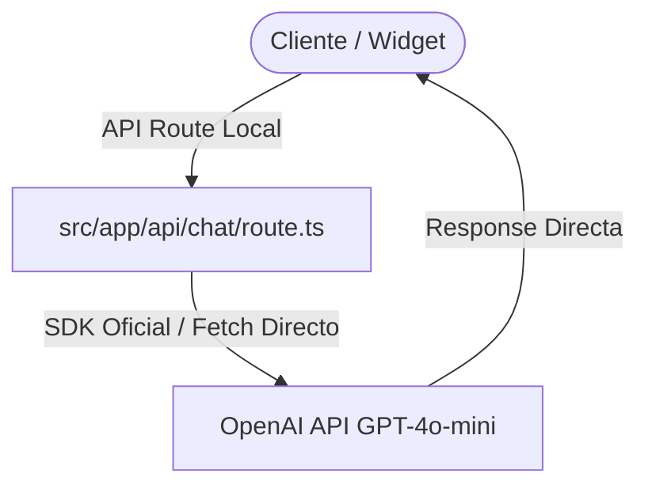

# Diagnóstico del Agente IA & Plan de Reestructuración

Este documento detalla la estructura actual del Agente de IA, la detección de ruido o intermediarios (n8n, Dify, etc.) y provee el **prompt exacto** para que un desarrollador o IA diagnostique el estado y realice la migración directa a la API de **GPT-4o-mini**.

---

## 1. Análisis de Estructura e Integraciones Actuales

Actualmente el código del proyecto tiene referencias y lógica para múltiples canales e intermediarios. Aquí detallamos dónde reside cada componente:

### A. Referencias a n8n y Dify (Intermediarios / Ruido)
* **`src/lib/settings.ts`**: Gestiona las variables de entorno asociadas a endpoints de `dify` y `n8n` (`DIFY_API_KEY`, `DIFY_BASE_URL`, `N8N_EVENT_WEBHOOK_URL`, `N8N_ALMA_WEBHOOK_URL`).
* **`src/app/api/dify-chat/route.ts`** y **`src/app/api/alma-chat/route.ts`**: APIs locales configuradas para retransmitir las conversaciones hacia estos servicios externos en vez de procesarlos de manera directa y nativa.

### B. Canales de Entrada y Widget
* **`src/app/layout.tsx`**: Inicializa el widget `@n8n/chat` directamente en el cliente, apuntando al webhook `alma-agent-2` de n8n.
* **`src/lib/whatsapp.ts`**: Gestionaba anteriormente el envío de eventos de UI al chat de n8n y posee lógica para abrir directamente chats de WhatsApp (`wa.me`) con plantillas dinámicas de productos.

---

## 2. Plan para Eliminar n8n/Dify e Integrar GPT-4o-mini Directo

Para simplificar la arquitectura, reducir latencia, eliminar costos de servidores intermediarios y tener control absoluto del Agente:



1. **Eliminar el Widget de n8n en el frontend**: Reemplazar el Script de n8n en `layout.tsx` por un widget de chat nativo en React/Next.js que consuma un endpoint de API local (`/api/chat`).
2. **Crear una API Route Directa**: Crear `src/app/api/chat/route.ts` que se conecte directamente con la API de OpenAI usando `gpt-4o-mini`.
3. **Mapear Variables**: Configurar `OPENAI_API_KEY` en el `.env.local` y eliminar las claves antiguas de Dify y n8n.

---

## 3. PROMPT DE DIAGNÓSTICO Y MIGRACIÓN (Copiar y usar)

Copia y pega el siguiente prompt en tu chat o agente de desarrollo para ejecutar la migración paso a paso:

```markdown
Eres un desarrollador Senior especializado en Next.js y APIs de IA. Necesitamos limpiar la arquitectura de nuestro agente de IA, remover intermediarios (n8n, Dify) y conectar directamente el sistema a la API de OpenAI usando el modelo GPT-4o-mini.

Sigue estos pasos detallados:

### PASO 1: Análisis y Limpieza de Variables
1. Modifica `src/lib/settings.ts` para remover referencias a:
   - `DIFY_API_KEY`
   - `DIFY_BASE_URL`
   - `N8N_EVENT_WEBHOOK_URL`
   - `N8N_ALMA_WEBHOOK_URL`
2. Agrega soporte para la variable `OPENAI_API_KEY`.
3. Informa al usuario para que agregue `OPENAI_API_KEY` a su archivo `.env.local` y elimine las variables legacy de Dify/n8n.

### PASO 2: Creación de API Route Directa (GPT-4o-mini)
1. Crea un nuevo endpoint en `src/app/api/chat/route.ts` (usando Route Handlers de Next.js App Router).
2. Utiliza la librería oficial `openai` o realiza llamadas directas vía `fetch` a `https://api.openai.com/v1/chat/completions`.
3. Implementa el modelo `gpt-4o-mini` con soporte para mantener un historial de conversación básico (memoria de sesión o basada en el payload del cliente).
4. El prompt de sistema (System Instructions) debe modelar el Agente de Atención al Cliente de "Joyería Alianzas":
   - Tono elegante, boutique, atento y sofisticado.
   - Experto en alianzas matrimoniales, metales (Oro 18k, Platino) y gemas.
   - Capaz de responder dudas sobre envíos nacionales, autenticidad certificada y procesos de compra.

### PASO 3: Remoción del Widget de n8n e Integración de un Chat Widget Nativo
1. Abre `src/app/layout.tsx`.
2. Remueve el stylesheet y script de `@n8n/chat` (`n8n-chat-widget`).
3. Diseña o implementa un componente simple de Chat flotante en React que interactúe directamente con nuestro nuevo endpoint `/api/chat` usando llamadas `fetch` asíncronas para mantener la conversación viva en la interfaz de usuario.

Reporta detalladamente los archivos modificados, el código implementado y los pasos para verificar localmente.
```